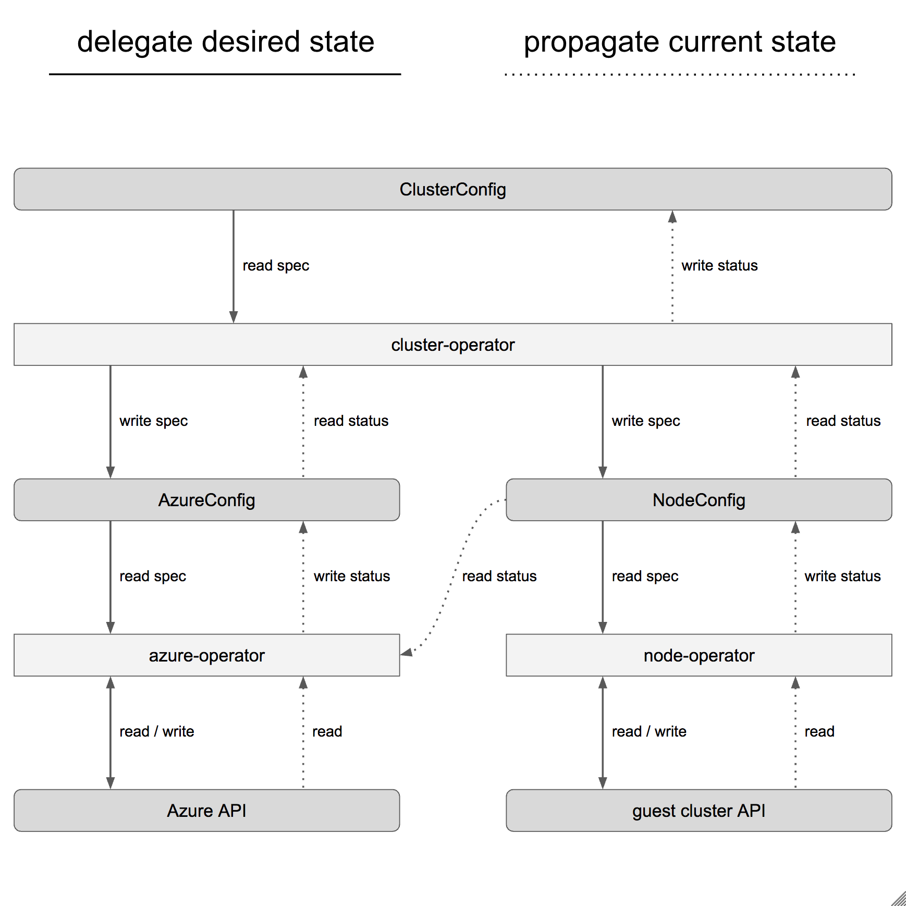

# Managing CR Status Sub Resources

Operators manage systems on behalf of custom resources (CRs). The managed state
of the system should always be reflected in the CRs status sub resource to make
these information available for consumption. The recommended pattern here is to
have [one operatorkit resource implementation to manage the system](https://github.com/giantswarm/chart-operator/tree/109f2b1f10d3500e4e9468ac901b0f344f37dd7b/service/controller/v3/resource/chart)
and [one operatorkit resource implementation to provide the system's state in the CRs status sub resource](https://github.com/giantswarm/chart-operator/tree/109f2b1f10d3500e4e9468ac901b0f344f37dd7b/service/controller/v3/resource/chartstatus).
In the linked example we have the `chart` resource and the `chartstatus`
resource. The advantage of this pattern is to have dedicated operatorkit
resource implementations which can reconcile independently. That way different
resync periods can be used for each operatorkit resource implementation.

All this is not black and white though. Best practises with the status
management will also evolve further. One aspect which always has to be
considered here is who reads and writes status and in which combination does
this occur to be relevant or dramatically different than in other projects. As a
guideline the approach of the separated resources should be considered the
default for now because it keeps different responsibilities separated not mixed
them up.

A common design guideline of an operator architecture is the **delegation and
propagation principle**. The visualization below depicts how **desired state is
delegated** and **current state is propagated**.

